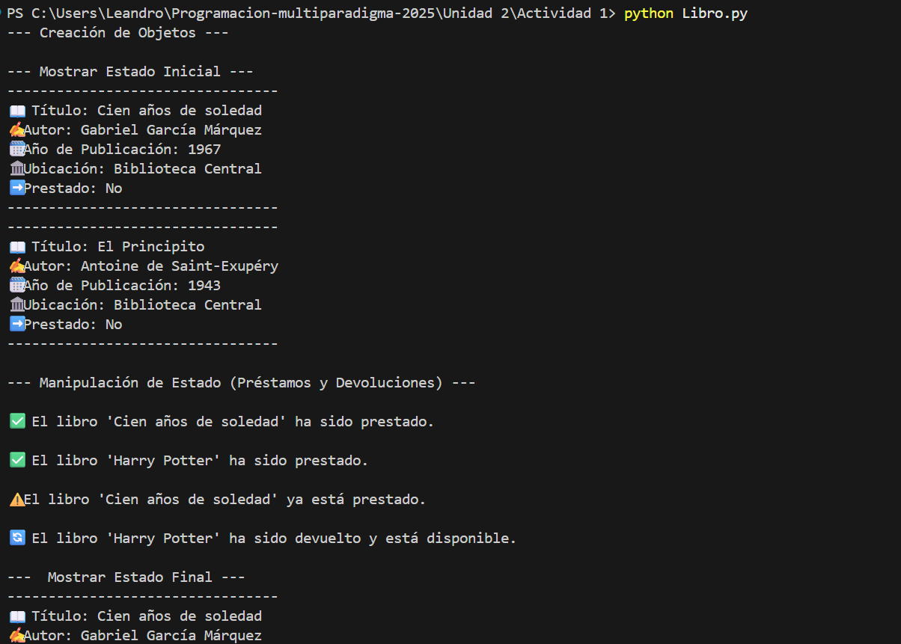
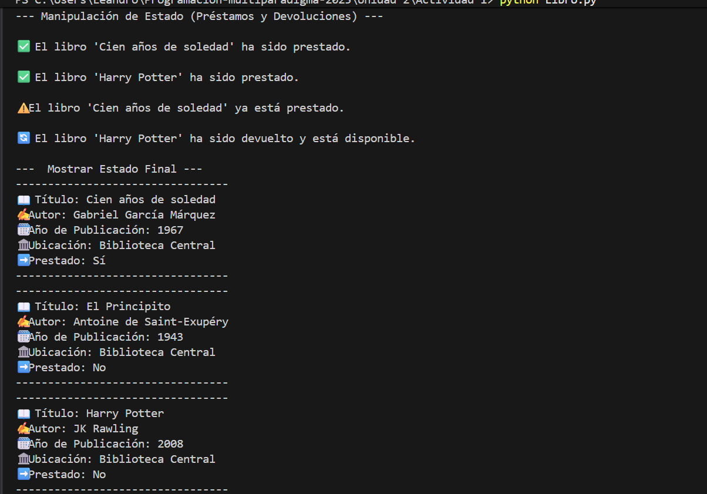

# TANAILY ALCALA BARRAZA 21100152

# Tarea: Clase Simple - Modelo Libro (POO en Python)

En esta práctica se realizó la implementación de la clase `Libro`.

## Diseño de la Clase `Libro`

Yo elegí modelar la clase `Libro` con los siguientes elementos:

### Atributos

| Tipo | Nombre | Propósito |
| :--- | :--- | :--- |
| **Clase** | `biblioteca` | Un atributo compartido por **todos** los objetos `Libro`. Representa el lugar al que pertenecen. |
| **Instancia** | `titulo`, `autor`, `anio_publicacion` | Representan las características **identificadoras** de cada libro, que son únicas por objeto. |
| **Instancia** | `prestado` (booleano) | Representa el **estado** mutable del libro. Se inicializa en `False` y se modifica con los métodos. |

### Métodos

| Método | Propósito | Concepto POO aplicado |
| :--- | :--- | :--- |
| `__init__` | Inicializar los atributos de instancia al crear un nuevo objeto. | **Constructor** e Inicialización de **Estado**. |
| `prestar()` / `devolver()` | Modificar el estado interno (`self.prestado`) de manera controlada. | **Comportamiento** (Acciones que el objeto puede realizar). |
| `mostrar_estado()` | Proporciona una forma legible y centralizada de acceder al estado completo del objeto. | **Comportamiento** e Interacción. |

Este diseño sigue el principio de POO donde los datos (`atributos`) y las operaciones sobre esos datos (`métodos`) están **encapsulados** juntos dentro de una única unidad: la clase `Libro`.

## Resultado de la Ejecución

Aqui mostramos la salida de la consola al crear, manipular y mostrar el estado de las instancias de `Libro`.

### Captura de Pantalla del Resultado

