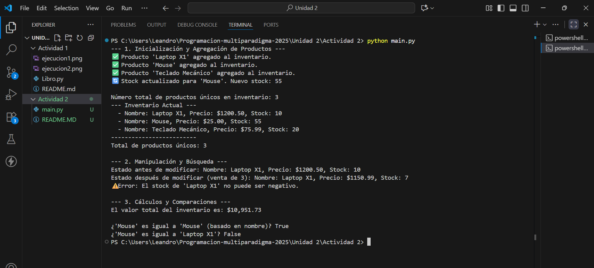

# TANAILY ALCALA BARRAZA 21100152

# Tarea: Clase Inventario y Encapsulación

En esta actividad se emplearon las clases `Producto` e `Inventario` aplicando los principios de la **Programación Orientada a Objetos (POO)**, con un enfoque en la **Encapsulación** y el uso de **Métodos Especiales**.

---

## Diseño de la Clase `Producto`

El objetivo principal de `Producto` es asegurar que los datos críticos (`stock` y `precio`) sean siempre válidos.

### Encapsulación Aplicada

| Atributo | Modificador | Justificación |
| :--- | :--- | :--- |
| `nombre` | **Público** | El nombre es la identidad del producto; su lectura/escritura directa no compromete la lógica de negocio. |
| `__stock` | **Privado** (`__`) | Ocultado para que solo se modifique a través del `@stock.setter`, garantizando que **nunca** sea menor que cero. |
| `_precio` | **Protegido** (`_`) | Ocultado y gestionado por `@precio.setter` para validar que **siempre** sea un valor mayor a cero. |

### Abstracción con `@property` y Métodos Especiales

* **Abstracción con `@property`:** Utilizamos `@property` (getters y setters) para que manipular el stock y el precio parezca una asignación simple (`producto.stock = 5`), pero internamente se ejecutan las **validaciones** que previenen estados inválidos (e.g., stock negativo o precio cero). Esto oculta la complejidad de la validación.
* **Métodos Mágicos:**
    * `__str__`: Permite que `print(producto)` muestre una representación amigable para el usuario.
    * `__eq__`: Define que dos productos son iguales si tienen el mismo `nombre`, ignorando si tienen distinto stock o precio.

---

## Diseño de la Clase `Inventario`

La clase `Inventario` actúa como una capa de **abstracción** sobre la colección de productos, gestionando las operaciones a nivel de sistema.

### Encapsulación Aplicada

* `__productos`: Es un diccionario **privado** (`__`) que almacena la colección. Esto evita que código externo pueda modificar directamente el diccionario (añadir/eliminar productos sin pasar por `agregar_producto`), protegiendo la integridad del inventario.

### Métodos Clave

* `agregar_producto`: Implementa lógica de negocio clave: si un producto ya existe, **actualiza el stock** en lugar de crear un duplicado, utilizando el *setter* de `Producto`.
* `total_valor_inventario`: Abstrae la compleja operación de suma y multiplicación en un solo método simple.
* `__len__`: Permite usar la función nativa `len(inventario)` para obtener el número de productos únicos, mejorando la legibilidad.

---

## 3. Resultado de la Ejecución

