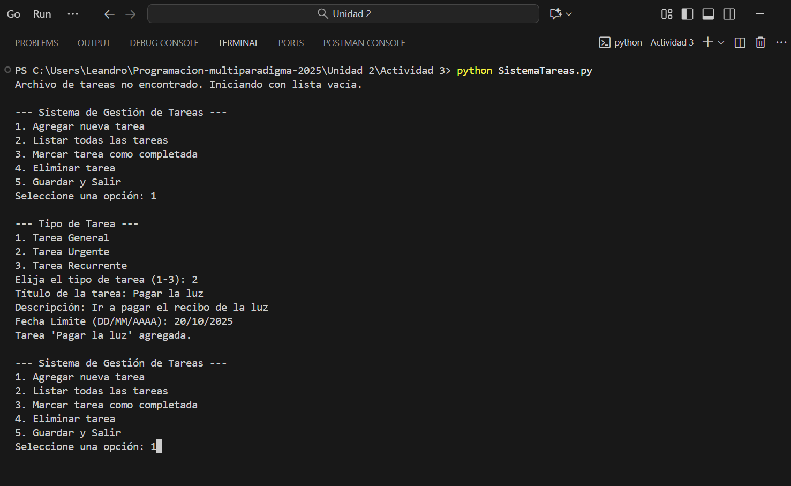
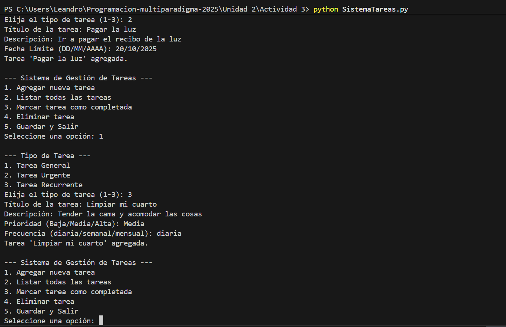
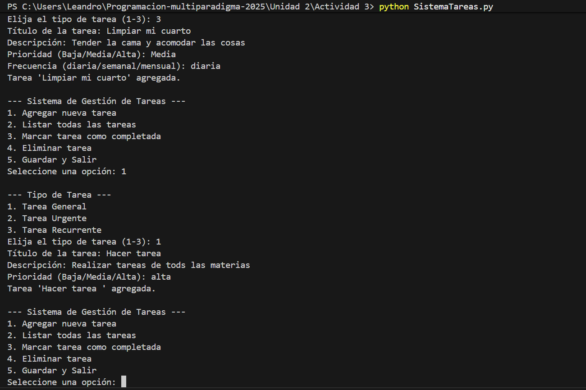
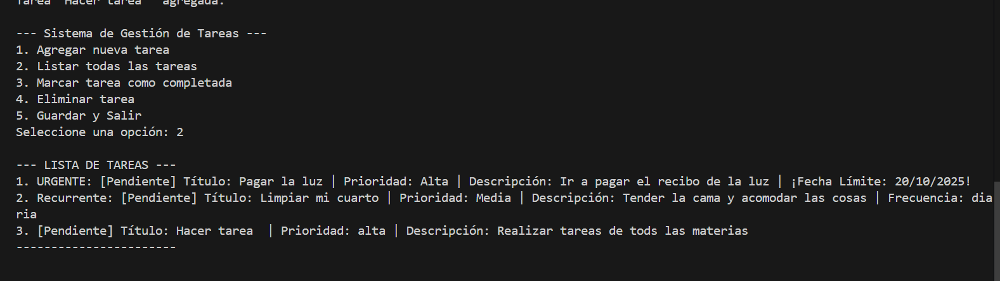
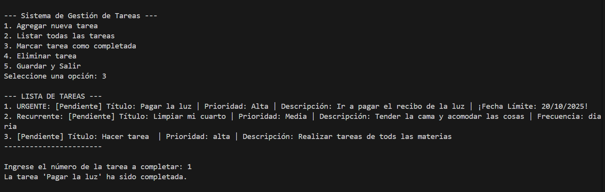
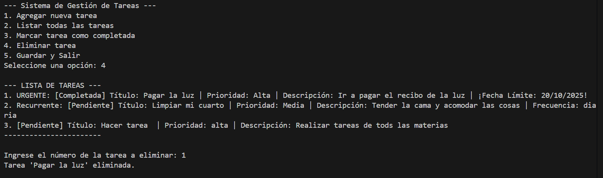
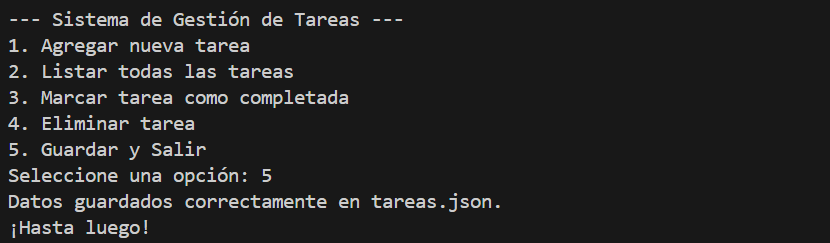

# TANAILY ALCALA BARRAZA 21100152
# ACTIVIDAD 3
# Sistema de Gestión de Tareas Personales 

## Descripción del Proyecto

En esta actividad se hizo un proyecto de un **Sistema de Gestión de Tareas** implementado en Python, diseñado para demostrar y aplicar los fundamentos de la **Programación Orientada a Objetos (POO)**, específicamente **Herencia**, **Polimorfismo** y **Encapsulación**.

El sistema permite a un usuario realizar las siguientes acciones mediante un menú interactivo en consola:

* Agregar nuevas tareas de diferentes tipos (General, Urgente, Recurrente).
* Listar todas las tareas registradas.
* Marcar tareas como completadas.
* Eliminar tareas.
* Mantener la persistencia de datos mediante almacenamiento en un archivo `tareas.json`.

---

## Diseño y Aplicación 

El sistema está estructurado alrededor de una jerarquía de clases diseñada para cumplir con los requisitos del proyecto:

### Herencia

Se utiliza la herencia para definir la especialización de los tipos de tarea a partir de una clase base común, promoviendo la reutilización del código base:

| Clase | Relación de Herencia | Comportamiento clave |
| :--- | :--- | :--- |
| `Tarea` | Clase Base | Define el comportamiento común (`_titulo`, `_completada`). |
| `TareaUrgente` | Hereda de `Tarea` | Sobrescribe el constructor para forzar la prioridad a "Alta" y añade `_fecha_limite`. |
| `TareaRecurrente` | Hereda de `Tarea` | Añade el atributo `_frecuencia` (diaria, semanal, etc.). |

### Polimorfismo

El principio de polimorfismo se aplica al método **`mostrar_info()`**:

* **En la clase `GestorTareas`**: El método `listar_tareas` llama a `tarea.mostrar_info()` sin saber exactamente de qué subclase es el objeto.
* **Comportamiento Polimórfico**: Cada clase derivada (`TareaUrgente`, `TareaRecurrente`) sobrescribe `mostrar_info()`, proporcionando una salida de texto única y específica que resalta sus atributos particulares (`Fecha Límite`, `Frecuencia`).

### Encapsulación

Se aplica la encapsulación para controlar el acceso a los datos internos:

* Todos los atributos clave (ej: `_titulo`, `_descripcion`, `_completada`) se definen como **protegidos** utilizando el prefijo de guion bajo (`_`).
* La modificación del estado de la tarea (`_completada`) solo se realiza a través de un método público controlado (`marcar_completada()`), asegurando que el estado interno se cambie de manera segura.

### Persistencia de Datos

La clase `GestorTareas` utiliza métodos de serialización (`to_dict` en las tareas) para guardar y cargar la información en el archivo `tareas.json`. Al cargar, se utiliza el atributo `tipo` que se guarda en el JSON para **reconstruir el objeto con la clase correcta** (`Tarea`, `TareaUrgente`, o `TareaRecurrente`), manteniendo la fidelidad de la herencia y el polimorfismo después de la carga.

---

## Ejecución

Para comenzar con las pruebas de nuestro sistema gestor de tareas, debemos correr nuestro código abriendo la terminal e ingresando “python SistemaTareas.py”. 

Lo primero que veremos será el menú principal, en el cual elegiremos la opción 1, para agregar una nueva tarea. 
Se ingresará una tarea de cada tipo, con sus respectivas características. 

Volveremos a ver el menú principal y ahora escogeremos la opción 2, que nos proporcionará un listado de las tareas que previamente ingresamos. 

Aparecerá de nuevo el menú principal y elegiremos  la opción 3, que es marcar una tarea como completada, veremos la lista de tareas y después ingresaremos la tarea que ya fue completada.

 

Nuevamente tendremos el menú principal y escogeremos la opción 4, esta es para eliminar una tarea. Veremos el listado de tareas, y en este caso eliminaremos la que previamente marcamos como completada. 

La última acción que realizaremos será escoger la opción 5 del menú principal, la cual guarda las acciones que realizamos y sale del programa.  

Foto 

